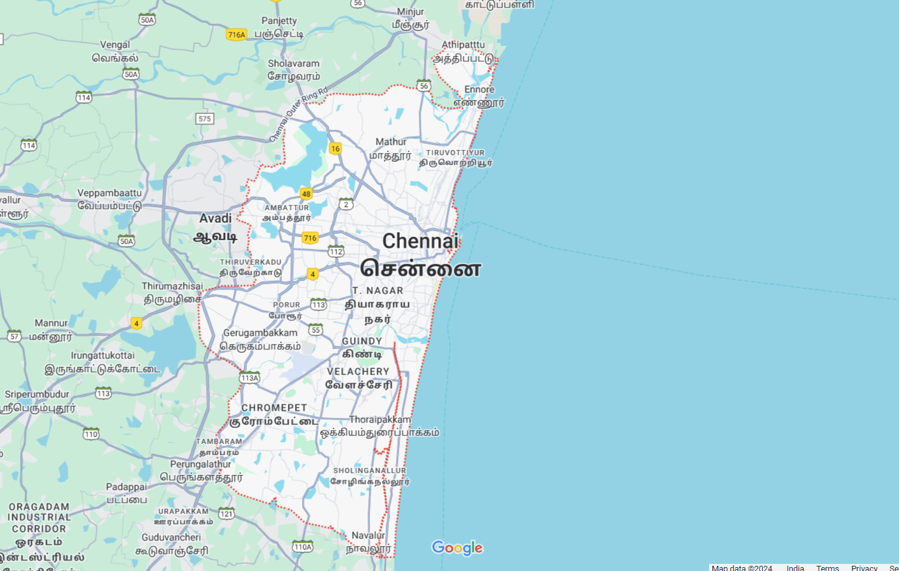
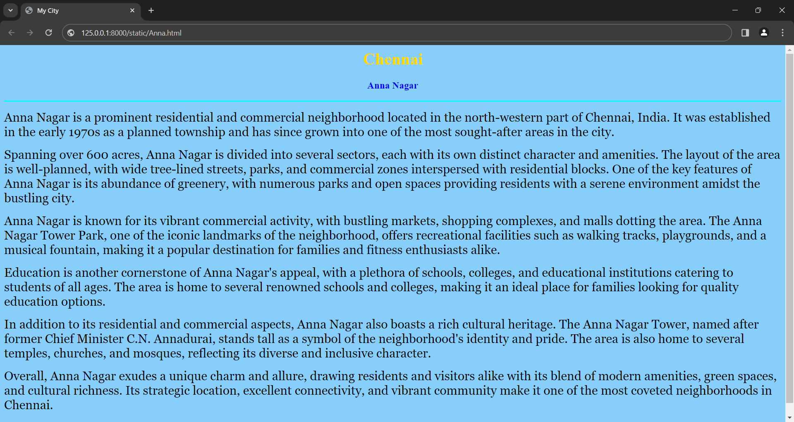
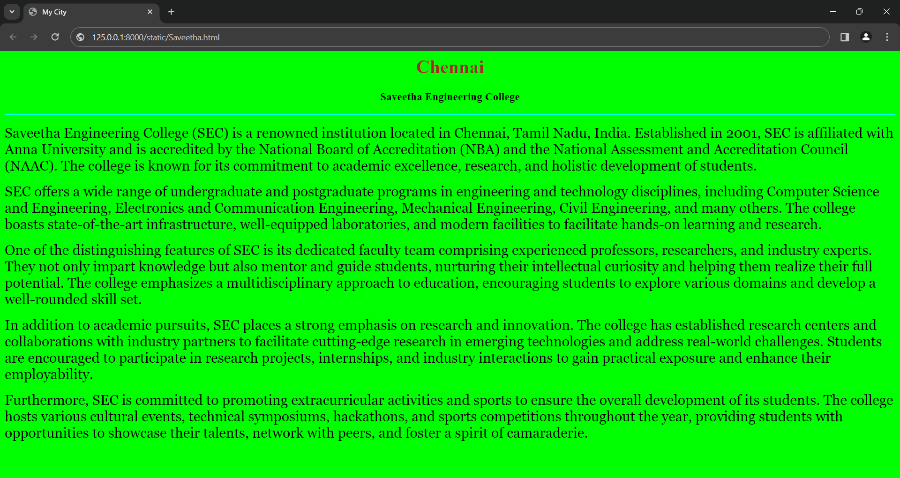
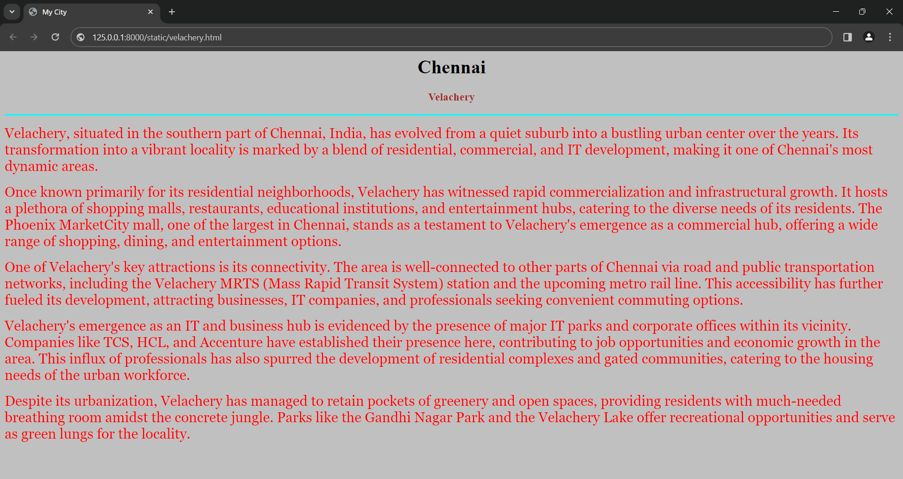
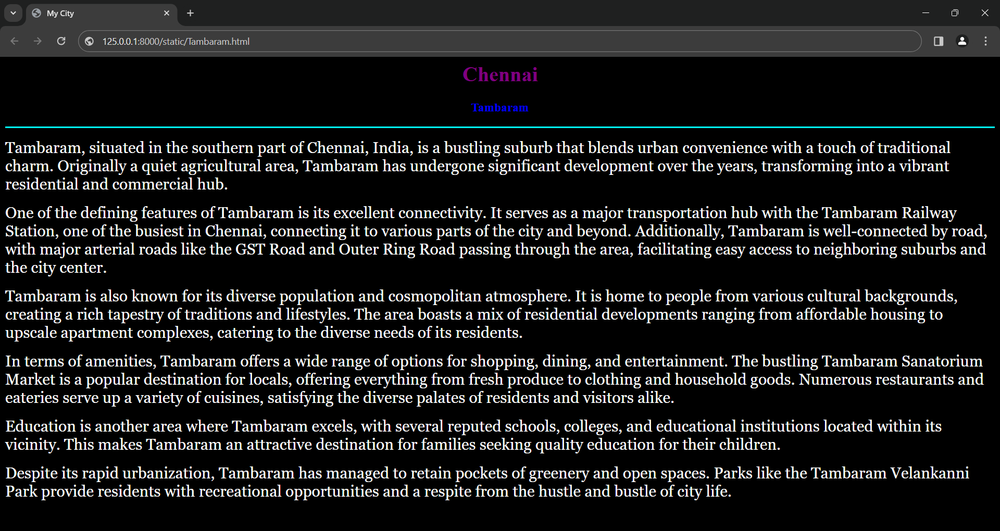
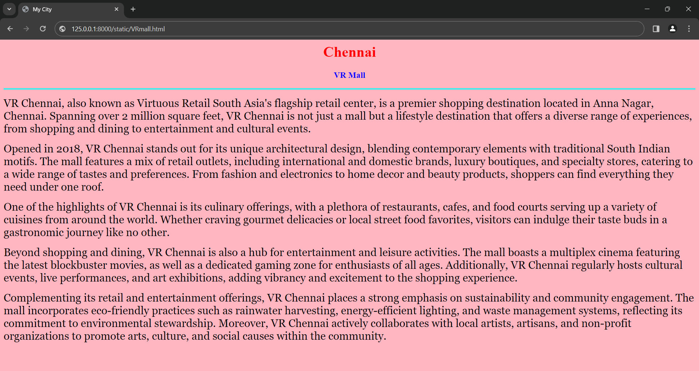

# Ex04 Places Around Me
## Date: 24-04-2024
## Name: Shyam R
## Roll.No: 212223040200
## Dept: CSE
## AIM
To develop a website to display details about the places around my house.

## DESIGN STEPS

### STEP 1
Create a Django admin interface.

### STEP 2
Download your city map from Google.

### STEP 3
Using ```<map>``` tag name the map.

### STEP 4
Create clickable regions in the image using ```<area>``` tag.

### STEP 5
Write HTML programs for all the regions identified.

### STEP 6
Execute the programs and publish them.

## CODE
```
map.html

<html>
    <head>
        <title>MAP APP</title>
    </head>
    <body>
        <h1 align="center">Chennai</h1>
        <h2 align="center"> Shyam R(212223040200)</h2>
        <center>
            

            <map name="image-map">
                <area target="" alt="Anna Nagar" title="Anna Nagar" href="Anna.html" coords="662,557,295,643" shape="rect">
                <area target="" alt="Saveetha Engineering College" title="Saveetha Engineering college" href="Saveetha.html" coords="761,224,82" shape="circle">
                <area target="" alt="Tambaram" title="Tambaram" href="Tambaram.html" coords="869,726,1010,704,1069,729,1001,757,937,757" shape="poly">
                <area target="" alt="Velachery" title="Velachery" href="velachery.html" coords="600,362,97" shape="circle">
                <area target="" alt="VR Mall" title="VR Mall" href="VRmall.html" coords="865,394,1042,468" shape="rect">
</center>
</map>
    </body>
</html>
```
```
Anna.html

<html>
    <head>
        <title>My City</title>
    </head>
    <body bgcolor="lightskyblue">
        <h1 align="center">
        <font color="gold"><b>Chennai</b></font>
        </h1>
        <h3 align="center">
        <font color="blue"><b>Anna Nagar</b></font>
        </h3>
        <hr size="3" color="cyan">
        <p align="justify">
        <font face="Georgia" size="5" color="black">
            <p>Anna Nagar is a prominent residential and commercial neighborhood located in the north-western part of Chennai, India. It was established in the early 1970s as a planned township and has since grown into one of the most sought-after areas in the city.

</p><p>Spanning over 600 acres, Anna Nagar is divided into several sectors, each with its own distinct character and amenities. The layout of the area is well-planned, with wide tree-lined streets, parks, and commercial zones interspersed with residential blocks. One of the key features of Anna Nagar is its abundance of greenery, with numerous parks and open spaces providing residents with a serene environment amidst the bustling city.

</p><p>Anna Nagar is known for its vibrant commercial activity, with bustling markets, shopping complexes, and malls dotting the area. The Anna Nagar Tower Park, one of the iconic landmarks of the neighborhood, offers recreational facilities such as walking tracks, playgrounds, and a musical fountain, making it a popular destination for families and fitness enthusiasts alike.

</p><p>Education is another cornerstone of Anna Nagar's appeal, with a plethora of schools, colleges, and educational institutions catering to students of all ages. The area is home to several renowned schools and colleges, making it an ideal place for families looking for quality education options.

</p><p>In addition to its residential and commercial aspects, Anna Nagar also boasts a rich cultural heritage. The Anna Nagar Tower, named after former Chief Minister C.N. Annadurai, stands tall as a symbol of the neighborhood's identity and pride. The area is also home to several temples, churches, and mosques, reflecting its diverse and inclusive character.

</p><p>Overall, Anna Nagar exudes a unique charm and allure, drawing residents and visitors alike with its blend of modern amenities, green spaces, and cultural richness. Its strategic location, excellent connectivity, and vibrant community make it one of the most coveted neighborhoods in Chennai.</p>
        </font>
        </p>
    </body>
</html>
```
```
Saveetha.html

<html>
    <head>
        <title>My City</title>
    </head>
    <body bgcolor="Lime">
        <h1 align="center">
        <font color="brown"><b>Chennai</b></font>
        </h1>
        <h3 align="center">
        <font color="black"><b>Saveetha Engineering College</b></font>
        </h3>
        <hr size="3" color="cyan">
        <p align="justify">
        <font face="Georgia" size="5" color="black">
        <p>Saveetha Engineering College (SEC) is a renowned institution located in Chennai, Tamil Nadu, India. Established in 2001, SEC is affiliated with Anna University and is accredited by the National Board of Accreditation (NBA) and the National Assessment and Accreditation Council (NAAC). The college is known for its commitment to academic excellence, research, and holistic development of students.

        </p><p>SEC offers a wide range of undergraduate and postgraduate programs in engineering and technology disciplines, including Computer Science and Engineering, Electronics and Communication Engineering, Mechanical Engineering, Civil Engineering, and many others. The college boasts state-of-the-art infrastructure, well-equipped laboratories, and modern facilities to facilitate hands-on learning and research.

        </p><p>One of the distinguishing features of SEC is its dedicated faculty team comprising experienced professors, researchers, and industry experts. They not only impart knowledge but also mentor and guide students, nurturing their intellectual curiosity and helping them realize their full potential. The college emphasizes a multidisciplinary approach to education, encouraging students to explore various domains and develop a well-rounded skill set.

</p><p>In addition to academic pursuits, SEC places a strong emphasis on research and innovation. The college has established research centers and collaborations with industry partners to facilitate cutting-edge research in emerging technologies and address real-world challenges. Students are encouraged to participate in research projects, internships, and industry interactions to gain practical exposure and enhance their employability.

</p><p>Furthermore, SEC is committed to promoting extracurricular activities and sports to ensure the overall development of its students. The college hosts various cultural events, technical symposiums, hackathons, and sports competitions throughout the year, providing students with opportunities to showcase their talents, network with peers, and foster a spirit of camaraderie.</p>
        </font>
        </p>
    </body>
</html>
```
```
Velachery.html

<html>
    <head>
        <title>My City</title>
    </head>
    <body bgcolor="Silver">
        <h1 align="center">
        <font color="Black"><b>Chennai</b></font>
        </h1>
        <h3 align="center">
        <font color="brown"><b>Velachery</b></font>
        </h3>
        <hr size="3" color="cyan">
        <p align="justify">
        <font face="Georgia" size="5" color="Red">
        </p><p>Velachery, situated in the southern part of Chennai, India, has evolved from a quiet suburb into a bustling urban center over the years. Its transformation into a vibrant locality is marked by a blend of residential, commercial, and IT development, making it one of Chennai's most dynamic areas.

        </p><p>Once known primarily for its residential neighborhoods, Velachery has witnessed rapid commercialization and infrastructural growth. It hosts a plethora of shopping malls, restaurants, educational institutions, and entertainment hubs, catering to the diverse needs of its residents. The Phoenix MarketCity mall, one of the largest in Chennai, stands as a testament to Velachery's emergence as a commercial hub, offering a wide range of shopping, dining, and entertainment options.
            
        </p><p>One of Velachery's key attractions is its connectivity. The area is well-connected to other parts of Chennai via road and public transportation networks, including the Velachery MRTS (Mass Rapid Transit System) station and the upcoming metro rail line. This accessibility has further fueled its development, attracting businesses, IT companies, and professionals seeking convenient commuting options.
            
        </p><p>Velachery's emergence as an IT and business hub is evidenced by the presence of major IT parks and corporate offices within its vicinity. Companies like TCS, HCL, and Accenture have established their presence here, contributing to job opportunities and economic growth in the area. This influx of professionals has also spurred the development of residential complexes and gated communities, catering to the housing needs of the urban workforce.
            
        </p><p> Despite its urbanization, Velachery has managed to retain pockets of greenery and open spaces, providing residents with much-needed breathing room amidst the concrete jungle. Parks like the Gandhi Nagar Park and the Velachery Lake offer recreational opportunities and serve as green lungs for the locality.</p>
            
        </font>
        </p>
    </body>
</html>
```
```
Tambaram.html

<html>
    <head>
        <title>My City</title>
    </head>
    <body bgcolor="black">
        <h1 align="center">
        <font color="purple"><b>Chennai</b></font>
        </h1>
        <h3 align="center">
        <font color="blue"><b>Tambaram</b></font>
        </h3>
        <hr size="3" color="cyan">
        <p align="justify">
        <font face="Georgia" size="5" color="white">
        </p><p>Tambaram, situated in the southern part of Chennai, India, is a bustling suburb that blends urban convenience with a touch of traditional charm. Originally a quiet agricultural area, Tambaram has undergone significant development over the years, transforming into a vibrant residential and commercial hub.

        </p><p>One of the defining features of Tambaram is its excellent connectivity. It serves as a major transportation hub with the Tambaram Railway Station, one of the busiest in Chennai, connecting it to various parts of the city and beyond. Additionally, Tambaram is well-connected by road, with major arterial roads like the GST Road and Outer Ring Road passing through the area, facilitating easy access to neighboring suburbs and the city center.

        </p><p>Tambaram is also known for its diverse population and cosmopolitan atmosphere. It is home to people from various cultural backgrounds, creating a rich tapestry of traditions and lifestyles. The area boasts a mix of residential developments ranging from affordable housing to upscale apartment complexes, catering to the diverse needs of its residents.

        </p><p>In terms of amenities, Tambaram offers a wide range of options for shopping, dining, and entertainment. The bustling Tambaram Sanatorium Market is a popular destination for locals, offering everything from fresh produce to clothing and household goods. Numerous restaurants and eateries serve up a variety of cuisines, satisfying the diverse palates of residents and visitors alike.

        </p><p>Education is another area where Tambaram excels, with several reputed schools, colleges, and educational institutions located within its vicinity. This makes Tambaram an attractive destination for families seeking quality education for their children.

        </p><p>Despite its rapid urbanization, Tambaram has managed to retain pockets of greenery and open spaces. Parks like the Tambaram Velankanni Park provide residents with recreational opportunities and a respite from the hustle and bustle of city life.</p>

        </font>
        </p>
    </body>
</html>

```
```
VR Mall.html

<html>
    <head>
        <title>My City</title>
    </head>
    <body bgcolor="lightpink">
        <h1 align="center">
        <font color="red"><b>Chennai
        </b></font>
        </h1>
        <h3 align="center">
        <font color="blue"><b>VR Mall</b></font>
        </h3>
        <hr size="3" color="cyan">
        <p align="justify">
        <font face="Georgia" size="5">
        </p><p>VR Chennai, also known as Virtuous Retail South Asia's flagship retail center, is a premier shopping destination located in Anna Nagar, Chennai. Spanning over 2 million square feet, VR Chennai is not just a mall but a lifestyle destination that offers a diverse range of experiences, from shopping and dining to entertainment and cultural events.

        </p><p>Opened in 2018, VR Chennai stands out for its unique architectural design, blending contemporary elements with traditional South Indian motifs. The mall features a mix of retail outlets, including international and domestic brands, luxury boutiques, and specialty stores, catering to a wide range of tastes and preferences. From fashion and electronics to home decor and beauty products, shoppers can find everything they need under one roof.

        </p><p>One of the highlights of VR Chennai is its culinary offerings, with a plethora of restaurants, cafes, and food courts serving up a variety of cuisines from around the world. Whether craving gourmet delicacies or local street food favorites, visitors can indulge their taste buds in a gastronomic journey like no other.

        </p><p>Beyond shopping and dining, VR Chennai is also a hub for entertainment and leisure activities. The mall boasts a multiplex cinema featuring the latest blockbuster movies, as well as a dedicated gaming zone for enthusiasts of all ages. Additionally, VR Chennai regularly hosts cultural events, live performances, and art exhibitions, adding vibrancy and excitement to the shopping experience.

        </p><p>Complementing its retail and entertainment offerings, VR Chennai places a strong emphasis on sustainability and community engagement. The mall incorporates eco-friendly practices such as rainwater harvesting, energy-efficient lighting, and waste management systems, reflecting its commitment to environmental stewardship. Moreover, VR Chennai actively collaborates with local artists, artisans, and non-profit organizations to promote arts, culture, and social causes within the community.</p>

        </font>
        </p>
    </body>
</html>
```

## OUTPUT










## RESULT
The program for implementing image maps using HTML is executed successfully.
